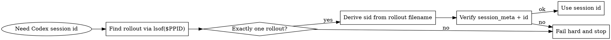

# Handoff (Codex)

## Overview

Create a handoff document for session continuity. Core principle: session id must be deterministic. Do not guess or use "latest".

## Deterministic session id (Codex)

### Primary resolver (PPID -> open rollout file)

When Codex runs a tool command, the shell process is a child of the Codex
process (`codex-aar`). In bash/zsh, `$PPID` is the parent PID. Use it to find
the exact rollout file this Codex process is writing.

1. Capture the parent PID:

   `ppid=$PPID`

2. Find the open rollout file (must be exactly one):

   `lsof -nP -p "$ppid" 2>/dev/null | rg '/\\.codex/sessions/.*/rollout-.*\\.jsonl'`

3. Extract the rollout path:

   `rollout=$(lsof -nP -p "$ppid" 2>/dev/null | rg '/\\.codex/sessions/.*/rollout-.*\\.jsonl' | awk '{print $NF}')`

4. Derive the session id from the rollout filename:

   `sid=$(printf "%s" "${rollout##*/}" | sed 's/^rollout-//' | cut -d- -f6- | sed 's/\\.jsonl$//')`

5. Verify the rollout file contains the expected session id:

   `rg -q --fixed-strings "\"type\":\"session_meta\"" "$rollout" && rg -q --fixed-strings "\"id\":\"$sid\"" "$rollout"`

### Fail hard conditions

- `lsof` returns 0 or >1 rollout files for `$PPID`.
- Rollout file does not contain the derived session id.

If any fail, stop and ask the user to restart the session or provide a deterministic session id.

## Handoff file

- Create `.agent/HANDOFF.<session-id>.md` at the project root (or current directory if no explicit root).
- Overwrite baton sections on update.
- Append to the Log section with timestamps.

## Template

```markdown
# Handoff: <session-id> (<session-title>)

## Current State (Baton)

<What needs to be picked up. What was I working on? What's the current status?>

## What's Left

<Remaining todos, blockers, next steps>

## Context

<Important decisions made, gotchas discovered, relevant file paths>

---

## Log

### <timestamp>
<What was accomplished in this update>
```

## Quick reference

| Task | Command |
| --- | --- |
| Get parent pid | `ppid=$PPID` |
| Find rollout via ppid | `lsof -nP -p "$ppid" 2>/dev/null \| rg '/\\.codex/sessions/.*/rollout-.*\\.jsonl'` |
| Extract session id | `sid=$(printf "%s" "${rollout##*/}" \| sed 's/^rollout-//' \| cut -d- -f6- \| sed 's/\\.jsonl$//')` |
| Verify session id | `rg -q --fixed-strings "\"id\":\"$sid\"" "$rollout"` |
| One‑liner (prints SESSION_ID) | `ppid=$PPID; line=$(lsof -nP -p "$ppid" 2>/dev/null \| rg '/\\.codex/sessions/.*/rollout-.*\\.jsonl' \| head -n 1); rollout=$(printf "%s" "$line" \| awk '{print $NF}'); sid=$(printf "%s" "${rollout##*/}" \| sed 's/^rollout-//' \| cut -d- -f6- \| sed 's/\\.jsonl$//'); echo "SESSION_ID=$sid"` |

## Example (bash)

Run this under bash (it uses `mapfile`). If your shell is zsh, run `bash -lc`
or save it to a file with `#!/usr/bin/env bash` and execute with `bash`.

```bash
#!/usr/bin/env bash
set -euo pipefail

ppid=$PPID

mapfile -t rollout_lines < <(lsof -nP -p "$ppid" 2>/dev/null | rg '/\\.codex/sessions/.*/rollout-.*\\.jsonl')
if [[ "${#rollout_lines[@]}" -ne 1 ]]; then
  echo "ERROR: expected exactly one rollout file from lsof; found ${#rollout_lines[@]}."
  printf "%s\n" "${rollout_lines[@]}" >&2 || true
  exit 1
fi

rollout=$(printf "%s\n" "${rollout_lines[0]}" | awk '{print $NF}')
sid=$(printf "%s" "${rollout##*/}" | sed 's/^rollout-//' | cut -d- -f6- | sed 's/\\.jsonl$//')

if ! rg -q --fixed-strings "\"type\":\"session_meta\"" "$rollout"; then
  echo "ERROR: rollout file missing session_meta"
  exit 1
fi
if ! rg -q --fixed-strings "\"id\":\"$sid\"" "$rollout"; then
  echo "ERROR: rollout file does not contain expected id $sid"
  exit 1
fi

mkdir -p .agent
cat > ".agent/HANDOFF.${sid}.md" <<'MD'
# Handoff: <session-id> (<session-title>)

## Current State (Baton)

<What needs to be picked up. What was I working on? What's the current status?>

## What's Left

<Remaining todos, blockers, next steps>

## Context

<Important decisions made, gotchas discovered, relevant file paths>

---

## Log

### <timestamp>
<What was accomplished in this update>
MD

echo "Wrote .agent/HANDOFF.${sid}.md"
```

## Decision flow (non-obvious)



## Common mistakes

- Use TERM_SESSION_ID or ITERM_SESSION_ID alone.
- Pick the most recent rollout file or history entry.
- Ignore multiple lsof matches.
- Run the bash example in zsh (mapfile is not available).
- Continue after a failed deterministic check.

## Rationalization table

| Excuse | Reality |
| --- | --- |
| "Latest session is probably mine." | Recency is not deterministic with concurrent sessions. |
| "TERM_SESSION_ID is unique enough." | It is terminal-specific, not Codex-specific. |
| "First match is fine." | Multiple matches mean ambiguity; stop. |
| "History.jsonl tail is good enough." | Non-deterministic; can point to another session. |

## Red flags - stop and fail hard

- "I will just pick the newest rollout file."
- "TERM_SESSION_ID should be fine."
- "Multiple matches; I will pick one."
- "No match; I will use history.jsonl."
