# Handoff (Codex)

## Overview

Create a handoff document for session continuity. Core principle: session id must be deterministic. Do not guess or use "latest".

## Deterministic session id (Codex)

### Primary resolver (PATH -> shell snapshot)

1. Extract the Codex temp PATH entry (unique per Codex session):

   `codex_path=$(echo "$PATH" | tr ':' '\n' | rg '^/Users/[^/]+/.codex/tmp/path/codex-arg0' | head -n 1)`

2. Find matching shell snapshot files:

   `rg -l --fixed-strings "$codex_path" ~/.codex/shell_snapshots/*.sh`

3. Require exactly one match. If 0 or >1, fail hard and stop.

4. Derive the session id from the snapshot filename:

   `sid="${snap##*/}"; sid="${sid%.sh}"`

5. Verify exactly one session file exists:

   `rg -l --fixed-strings "\"id\":\"$sid\"" ~/.codex/sessions -g "rollout-*.jsonl"`

### Fail hard conditions

- No codex-arg0 PATH entry found.
- 0 or >1 matching snapshots.
- 0 or >1 matching session jsonl files.

If any fail, stop and ask the user to restart the session or provide a deterministic session id.

## Handoff file

- Create `.agent/HANDOFF.<session-id>.md` at the project root (or current directory if no explicit root).
- Overwrite baton sections on update.
- Append to the Log section with timestamps.

## Template

```markdown
# Handoff: <session-id> (<session-title>)

## Current State (Baton)

<What needs to be picked up. What was I working on? What's the current status?>

## What's Left

<Remaining todos, blockers, next steps>

## Context

<Important decisions made, gotchas discovered, relevant file paths>

---

## Log

### <timestamp>
<What was accomplished in this update>
```

## Quick reference

| Task | Command |
| --- | --- |
| Find Codex PATH entry | `echo "$PATH" | tr ':' '\n' | rg '^/Users/[^/]+/.codex/tmp/path/codex-arg0' | head -n 1` |
| Find snapshot matches | `rg -l --fixed-strings "$codex_path" ~/.codex/shell_snapshots/*.sh` |
| Extract session id | `sid="${snap##*/}"; sid="${sid%.sh}"` |
| Verify session file | `rg -l --fixed-strings "\"id\":\"$sid\"" ~/.codex/sessions -g "rollout-*.jsonl"` |

## Example (bash)

Run this under bash (it uses `mapfile`). If your shell is zsh, run `bash -lc`
or save it to a file with `#!/usr/bin/env bash` and execute with `bash`.

```bash
#!/usr/bin/env bash
set -euo pipefail

codex_path=$(echo "$PATH" | tr ':' '\n' | rg '^/Users/[^/]+/.codex/tmp/path/codex-arg0' | head -n 1)
if [[ -z "$codex_path" ]]; then
  echo "ERROR: codex PATH entry not found; cannot resolve session id deterministically."
  exit 1
fi

mapfile -t snaps < <(rg -l --fixed-strings "$codex_path" ~/.codex/shell_snapshots/*.sh)
if [[ "${#snaps[@]}" -ne 1 ]]; then
  echo "ERROR: expected exactly one matching shell snapshot; found ${#snaps[@]}."
  exit 1
fi

sid="${snaps[0]##*/}"
sid="${sid%.sh}"

mapfile -t sessions < <(rg -l --fixed-strings "\"id\":\"$sid\"" ~/.codex/sessions -g "rollout-*.jsonl")
if [[ "${#sessions[@]}" -ne 1 ]]; then
  echo "ERROR: expected exactly one session file for $sid; found ${#sessions[@]}."
  exit 1
fi

mkdir -p .agent
cat > ".agent/HANDOFF.${sid}.md" <<'MD'
# Handoff: <session-id> (<session-title>)

## Current State (Baton)

<What needs to be picked up. What was I working on? What's the current status?>

## What's Left

<Remaining todos, blockers, next steps>

## Context

<Important decisions made, gotchas discovered, relevant file paths>

---

## Log

### <timestamp>
<What was accomplished in this update>
MD

echo "Wrote .agent/HANDOFF.${sid}.md"
```

## Decision flow (non-obvious)

```dot
digraph resolve_session_id {
  rankdir=LR;
  start [label="Need Codex session id", shape=ellipse];
  has_path [label="codex-arg0 PATH entry found?", shape=diamond];
  find_snap [label="Find snapshot matches", shape=box];
  one_snap [label="Exactly one match?", shape=diamond];
  verify [label="Verify session file", shape=box];
  one_session [label="Exactly one session file?", shape=diamond];
  use_id [label="Use session id", shape=box];
  fail [label="Fail hard and stop", shape=box];

  start -> has_path;
  has_path -> find_snap [label="yes"];
  has_path -> fail [label="no"];
  find_snap -> one_snap;
  one_snap -> verify [label="yes"];
  one_snap -> fail [label="no"];
  verify -> one_session;
  one_session -> use_id [label="yes"];
  one_session -> fail [label="no"];
}
```



## Common mistakes

- Use TERM_SESSION_ID or ITERM_SESSION_ID alone.
- Pick the most recent rollout file or history entry.
- Ignore multiple snapshot matches.
- Run the bash example in zsh (mapfile is not available).
- Continue after a failed deterministic check.

## Rationalization table

| Excuse | Reality |
| --- | --- |
| "Latest session is probably mine." | Recency is not deterministic with concurrent sessions. |
| "TERM_SESSION_ID is unique enough." | It is terminal-specific, not Codex-specific. |
| "First match is fine." | Multiple matches mean ambiguity; stop. |
| "History.jsonl tail is good enough." | Non-deterministic; can point to another session. |

## Red flags - stop and fail hard

- "I will just pick the newest rollout file."
- "TERM_SESSION_ID should be fine."
- "Multiple matches; I will pick one."
- "No match; I will use history.jsonl."
